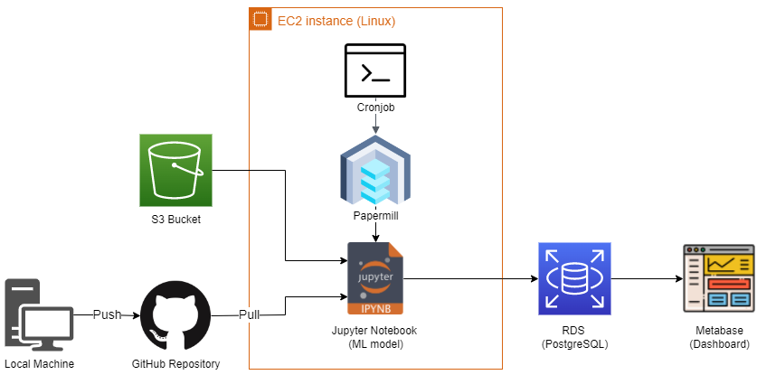

# High Value Customers (Insiders) - Clustering

  

# 1. CONTEXT

The All in One Place is an E-commerce store that sells a variety of products, from different brands and prices. The marketing team realized that some customers stood out for the amount spent and the frequency, so they wanted to provide some benefits to these customers to maintain their loyalty. Also, they wanted to know the main characteristics of this group of customers, to understand their influence on the company's revenue.

This group of high value customers are called "Insiders". To be able to create this group, a clustering model is needed, to group the customers with desirable characteristics, such as high ticket, low recency, high frequency and others.

## 1.1. BUSINESS PROBLEM

* **Motivation**
  * The All in One Place sales team wants to know who the high value customers are and their main characteristics. 

* **The problem's root cause** 
  * They wanted to provide some benefits to these customers to maintain their loyalty.

* **The Stakeholder**
  * The marketing team.

* **The solution format**
  * Develop a model which can identify clusters (groups), so the Insiders will be separated from the other customers.
  * **Questions to be answered:**
    * Who are the eligible customers to the program?
    * How many customers will be part of the group?
    * What are the main characteristics of these customers?
    * What is the percentage of revenue contribution from the Insiders?
    * What is the expected revenue from the Insiders for the next few months?
    * What are the conditions for a person to be eligible as an Insider?
    * What are the conditions for a person to be removed from the Insiders?
    * What is the guarantee that the Insiders are better than the rest?
    * What actions could be done by the marketing team to increase the revenue?
  * **Delivery method:** 
    * A database in the cloud (AWS RDS) where the information about the customers are stored including their clusters that are indicated by numbers. Also, a basic dashboard will be delivered with a connection to the database to facilitate the visualization for the sales team.

# 2. DATA
The dataset is in CSV format and can be found at the following kaggle link: https://www.kaggle.com/vik2012kvs/high-value-customers-identification.

## 2.1. FILES
The file used for the project is as follows:
* **Ecommerce.csv** - historical data where each row is a product bought by a certain customer between December 2016 and December 2017. 

## 2.2. DATA FIELDS
* **InvoiceNO:** Unique transaction identifier
* **StockCode:** Unique item identifier
* **Description:** Item description
* **Quantity:**  Item purchased quantity 
* **InvoiceDate:** Date of the transaction
* **UnitPrice:** Item unit price
* **CustomerID:** Unique customer identifier
* **Country:** The name of the country where the customer resides in

# 3. PROJECT MANAGEMENT METHOD
The management method used for this project was based on the CRISP-DM, which is a cyclic developing method focused on delivering a solution as soon as possible and then improving it in the next cycles. 

The steps performed are as follows: 

1. **Business problem understanding**
    * Defining the motivation, problem's root cause, who is the stakeholder and the solution format.

2. **Data Description**
    * Checking dimensions, data types and NA values to apply descriptive statistics methods to better understand the data fields and their characteristics.

3. **Data Filtering**
    * Filtering rows and columns that are not relevant to solve the problem. 

4. **Feature Engineering**
    * Creating new features and raising hypotheses to understand the phenomenon that is being modeled and its agents.

5. **Exploratory Data Analysis (EDA)**
    * Validating the business hypotheses;
    * Understanding what might be the most important features to the model;
    * Finding the best data space to create clusters.
      * Using embedding to reduce the dimensionality.

6. **Data Preparation**
    * Preparing the data to be used for the machine learning model.
      * Applying Scaling transformation. 

7. **Feature Selection**
    * Selecting the most significant features to train the model.

8. **Hyperparameter Fine-Tuning**
    * Finding optimal number of clusters (K).
      * Testing different machine learning models and Ks;
        * K-means, GMM, Hierarchical Clustering and DBSCAN were tested.
      * Using Silhouette Score to determine the best model and value for K.    
      
9. **Model Training**
    * Training the best model and getting its performance metrics.
   
10. **Cluster Analysis**
    * Analyzing the clusters obtained and their characteristics;
    * Responding to the business questions.

11. **Deploy Model To Production**
    * Creating a pipeline in the cloud (AWS) to make the process available to the user.
      * EC2, S3 and RDS were used to create it, and the metabase to create a dashboard.

# 4. Results

## 4.1. MACHINE LEARNING MODEL
Five data spaces were tested to find the most well defined clusters:

* Original 
* From PCA
* From UMAP
* From t-SNE
* From Tree-based embedding

The following metrics were used to choose the best model:

* Silhouette Score
* Business assumptions

To choose the best data space, the Silhouette Score was used within visual spections when there was just 2 dimensions and the final results obtained on the cluster analysis. In the last cycle, it was decided to use the original data space, because the cluster Insiders created with this space was the best fit for the business problem, as will be shown in the next section.

The models were trained with different values for K and its Silhouette Scores were compared to choose the best one and a value for K.

|           |     2    |     3    |     4    |    5     |    6     |    7     |     8    |     9    |    10    |    11    |     12   |     13   |    14    |     15   |
|:---------:|:--------:|:--------:|:--------:|:--------:|:--------:|:--------:|:--------:|:--------:|:--------:|:--------:|:--------:|:--------:|:--------:|:--------:|
|KMeans	     |0.689180 |0.632644	|0.542587	 |0.533976	|0.512531	 |0.506438	|0.488311	 |0.446134	|0.436967	 |0.450934	| 0.451015 |	0.446832| 0.444745 | 0.473795	|
|GMM	       |-0.058279|-0.273269	|-0.093058 |-0.045796 |	-0.000073|-0.147786	|-0.268632 |-0.220818	|-0.222257 |-0.225105	|-0.241462 |-0.247155 |-0.321111 |-0.111884 |
|HC          |0.682134 |0.640887	|0.523376	 |0.524095	|0.523031	 |0.527399	|0.480081	 |0.464021	|0.368133	 |0.364492	|0.401858	 |0.403315	|0.408088	 |0.408424  |

According to the Silhouette Score for each model and K, the best model is the KMeans with K = 2. But it's not a good separation in business terms, since there is a lot of customers in each cluster. As a basis for comparison, the RFM model splits the customers into 10 groups. So, the closest number to 10 with the highest Silhouette Score was chosen to be used in production, which was K = 7 for the Hierarchical Clustering model.   

The clusters found are as follows:

|cluster |qty_customers |perc_customer |avg_gross_revenue |avg_recency_days |avg_frequency |avg_qty_products |avg_returns|
|:------:|:------------:|:------------:|:----------------:|:---------------:|:------------:|:---------------:|:---------:|
|2 |7 |0.12% |$171,711 |6 days |0.19 purchases/day |87,276 products |1,056 products|
|3 |2281 |40.05% |$2,629 |18 days |0.28 purchases/day |1,520 products |34 products|
|1 |1262 |22.16% |$1,043 |78 days |0.51 purchases/day |591 products |7 products|
|4 |277 |4.87% |$905 |362 days |1.05 purchases/day |251 products |2 products|
|5 |486 |8.53% |$771 |305 days |0.94 purchases/day |390 products |155 products|
|6 |700 |12.30% |$717 |163 days |0.70 purchases/day |318 products |4 products|
|7 |682 |11.98% |$662 |236 days |0.88 purchases/day |271 products |18 products|

## 4.2. BUSINESS PERFORMANCE
Answering to the business questions based on the results:

* **1. Who are the eligible customers to the program?**
    * The customers with the following "customer_id": 
      * 15
      * 66
      * 191
      * 434
      * 492
      * 1150
      * 14646
	
  
* **2. How many customers will be part of the group?**
    * For now, 7 customers (0.12% of the total customers) will be part of the Insiders.

* **3. What are the main characteristics of these customers?**
    * **Average gross revenue:** $171,711
    * **Average recency days:** 6 days
    * **Average frequency:** 0.19 purchases/day
    * **Average products purchased:** 87,276 products
    * **Average products returned:** 1,056 products
   
* **4. What is the percentage of revenue contribution from the Insiders?**
    * It is 11.9% ($1,201,978.37 of $10,096,818.07).

* **5. What is the expected revenue from the Insiders for the next few months?**
    * This question will be not answered for now.

* **6. What are the conditions for a person to be eligible as an Insider?**
  * The person has to have similar characteristics to the ones described in question 3 to be eligible, focusing on high gross revenue and quantity of products.

* **7. What are the conditions for a person to be removed from the Insiders?**
  * The person has to have different characteristics to the ones described in question 3.

* **8. What is the guarantee that the Insiders are better than the rest?**
  * Based on the percentage of revenue contribution and purchase volume, we can see that the insiders stand out.

* **9. What actions could be done by the marketing team to increase the revenue?**
  * They can focus on the second cluster with the higher gross revenue and stimulate them to buy more or more expensive products, giving discounts or a special service, to put them closer to the insiders.

# 5.DEPLOY

The model was deployed using an AWS EC2 instance running Ubuntu. An Activity was set on Cronjob to execute a bash script that calls the Papermill that executes the Jupyter Notebook containing the model and strunctions to perform the clusterization. The data comes from a S3 bucket and the output is saved on a PostgreSQL database, which can be accessed by the user using to create dashboards and reports.  

  

